# Operationalizing Machine Learning

## Overview

### Project
In this project we will work with the `bankmarketing_train.csv` dataset from the [UCI Machine Learning Repository](https://archive.ics.uci.edu/ml/datasets/Bank+Marketing) to configure a cloud-based machine learning production model, deploy it, and consume it. We will also create, publish, and consume a pipeline. At the end of this README, a screencast video is also added.

## Architectural Diagram

In this project, we will start by ingesting the Bank Marketing dataset into the Azure Machine Learning Studio workspace and then create and train a machine learning model with an automated machine learning experiment. Once the model training is completed, we will deploy the best model into an Azure Container Instance (ACI), enable Applications Insights, consume the deployed model using Swagger in a docker container, as well as consume the model endpoint and then benchmark it with Apache Bench.

Next we will move on to to launch a Jupyter notebook in Azure ML Studio and build a pipeline using the Python SDK and finally we will create, publish and consume the pipeline and pipeline endpoints.

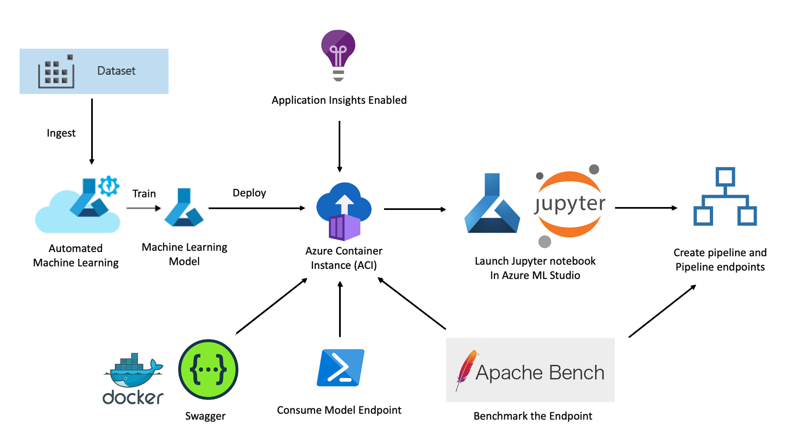

## Key Steps

In this project, we will be go through the following 7 steps:

### Step 1: Authentication 

In this step, we will create a `Service Principal` account and associate it with the Azure Machine Learning workspace using the `az` command. 

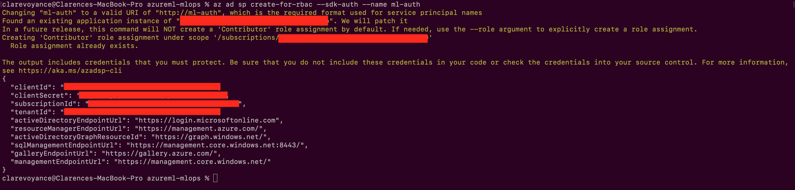

### Step 2: Automated ML Experiment

At this point, security is enabled and authentication is completed. in this step, we will upload the bank marketing dataset, create an experiment using Automated ML, configure a compute cluster, and use that cluster to run the experiment.

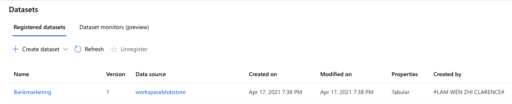

After uploading the bank marketing data set, we will proceed to begin an AutoML experiment. We will select classification as this is a binary classification problem.

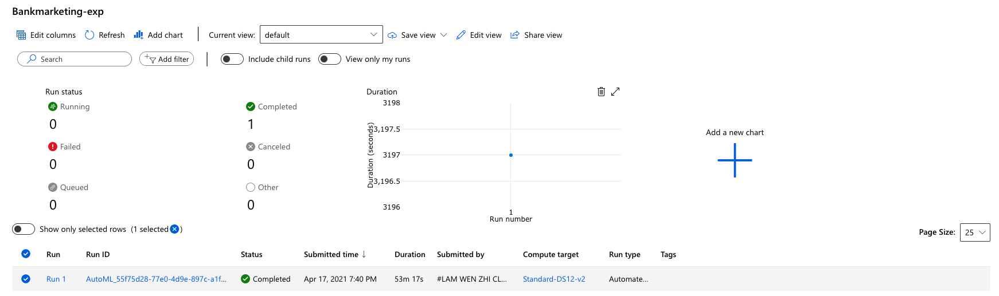

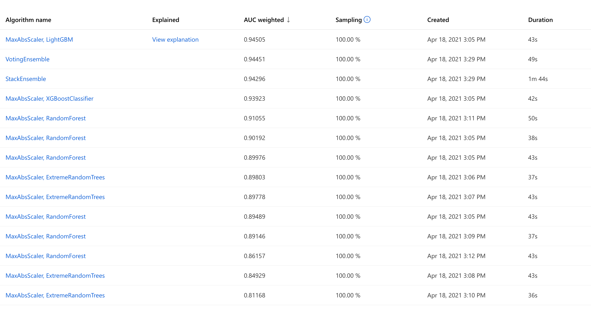

At the end of the autoML experiment, the best model `MaxAbsScaler, LightGBM` has been found and we will be deploying this model as an endpoint with Azure Container Instance (ACI). We will do this first by clicking on the best model and we will see the next screenshot in Step 3.

### Step 3: Deploy The Best Model

After the experiment run is completed, a summary of all the models and their metrics are shown, including explanations. The *Best Model* will be shown in the *Details* tab. In the *Models* tab, the models will be ranked from best to worst and we will use the best model for deployment.

Deploying the model will allow for interaction with the HTTP API service and to interact with the model by sending data over POST requests.

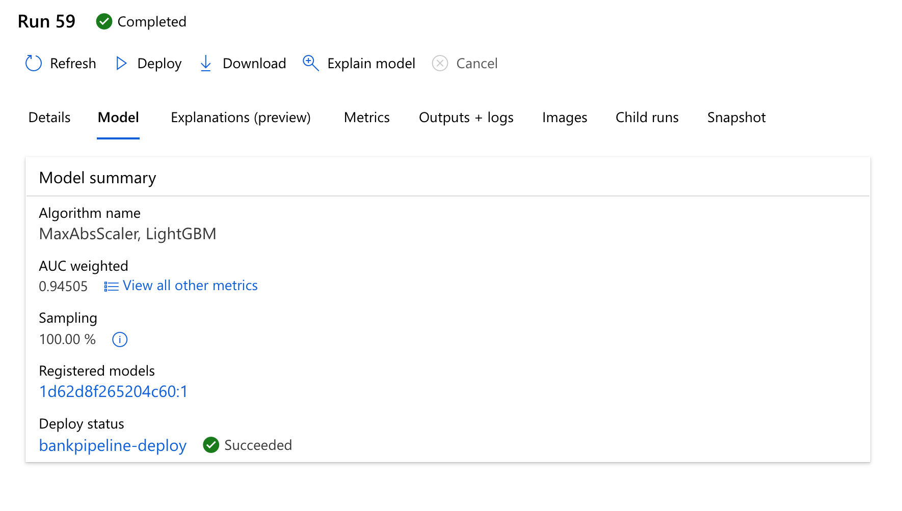

### Step 4: Enable Logging

We choose the best model for deployment and enable "Authentication" while deploying the model using Azure Container Instance (ACI). The executed code in logs.py enables Application Insights. "Application Insights enabled" is disabled before executing `logs.py`. We will also use `wget` to retrieve the `swagger.json` link found in the deployed endpoint details.

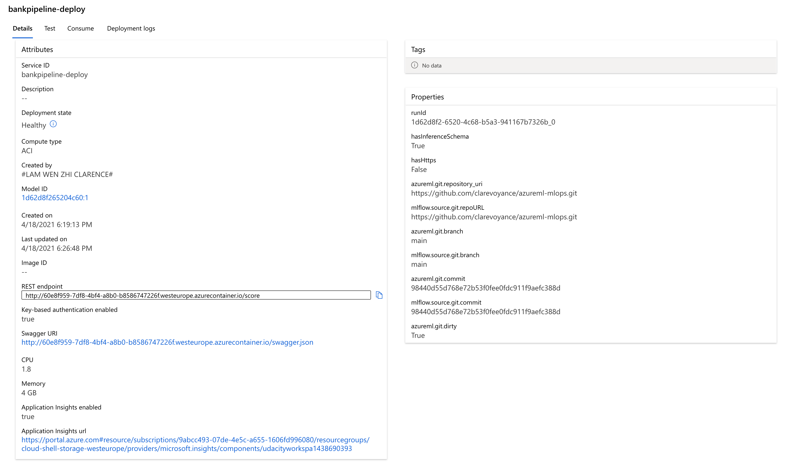

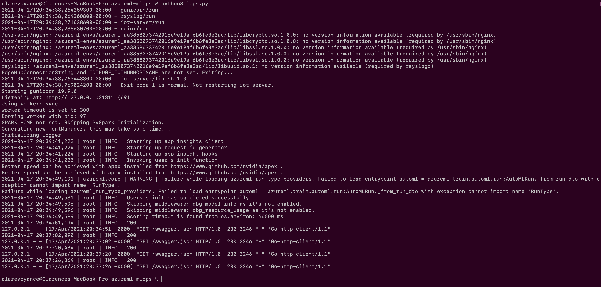

### Step 5: Swagger Documentation 

In this step, we will consume the deployed model using Swagger which will run on port `9000`. The `swagger.json` that was generated from the ACI endpoint page has also been created in the same directory. After running the `swagger.sh` in the terminal, a docker container will be created and the default Swagger petstore json will be launched locally. We will change this to the `swagger.json` with `http://localhost:9000/swagger.json`.

We can see that the input payload for executing the machine learning service. 

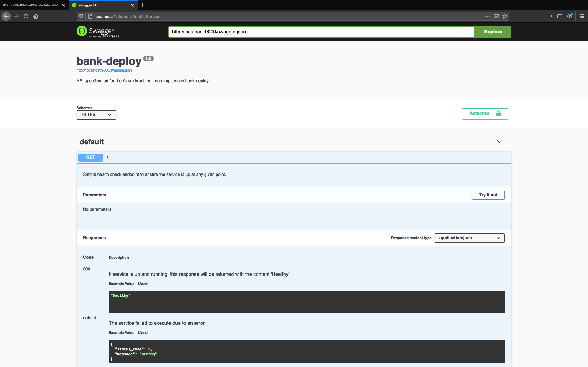

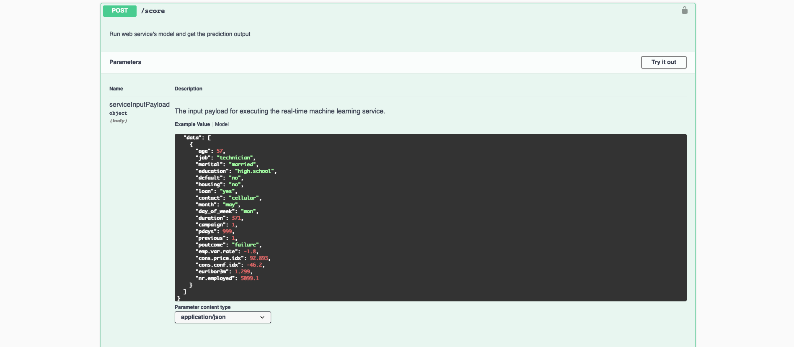

### Step 6: Consume Model Endpoint

Once the model is deployed, we will use the `endpoint.py` script provided to interact with the trained model. We will also modify the `scoring_uri` and `key` to match the key for the service and the URI that was generated after deployment. This can be found in the 'Consume' tab of the endpoint. For the purpose of security, the keys have been regenerated and removed from this repository.

In addition, we have also run a benchmark test using Apache Bench.

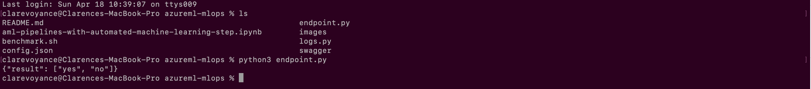

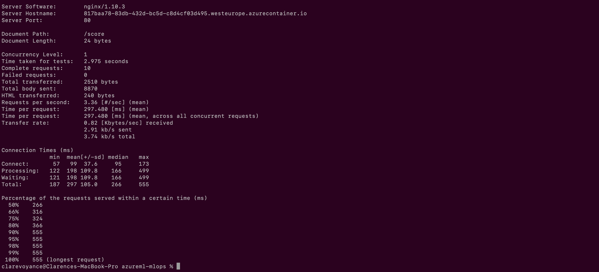

### Step 7: Create, Publish and Consume a Pipeline

For this next part of the project, we will use Jupyter Notebook to create a pipeline. This is in the notebook titled `aml-pipelines-with-automated-machine-learning-step.ipynb` found in this same directory.

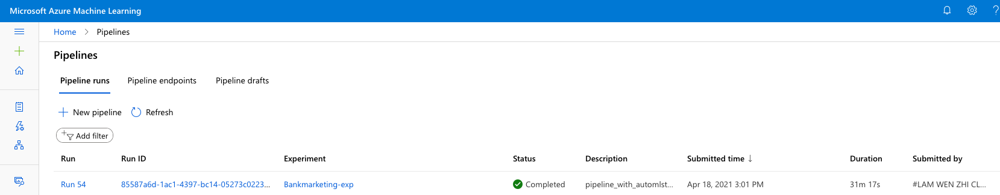

After creating a pipeline run using the Python SDK as well as creating the AutoMLStep, we will submit it. When the run is completed, it will show the status as `Completed` as seen in the screenshot above. When we are satisfied with the best fit model, we will move on the publish and run from the REST pipeline endpoint `Bankmarketing Train`.

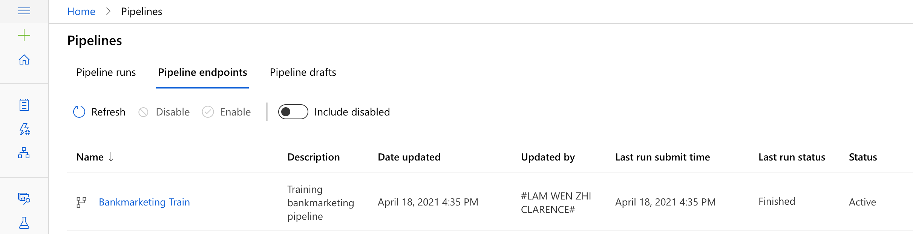

To ensure this was properly published, we will open it and you can see the `Status` now shows as `ACTIVE`.

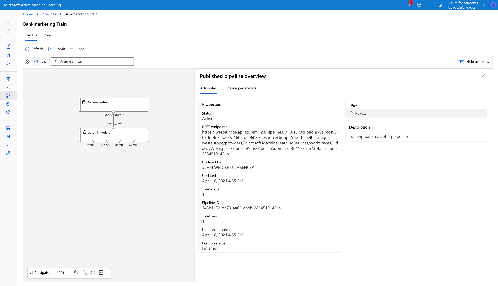

Using the REST endpoint url, we can build a HTTP POST request to the endpoint.

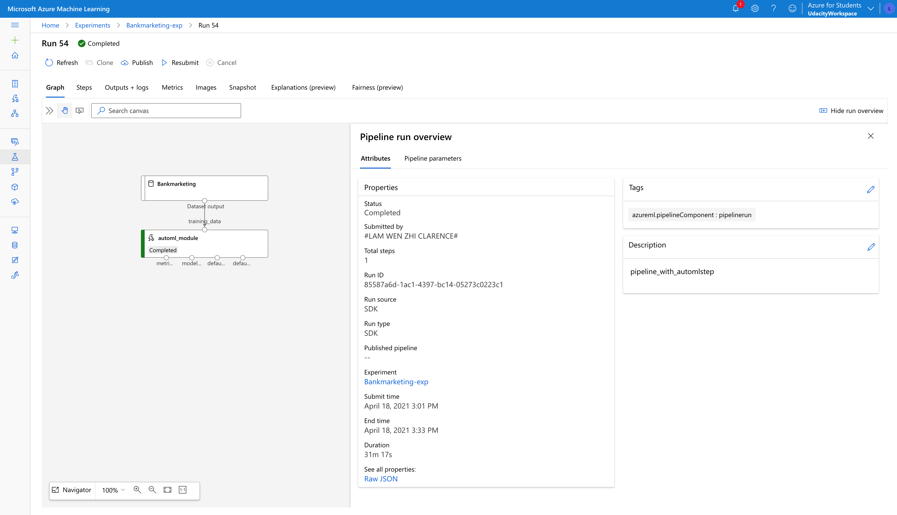

Finally, we will add a JSON payload object with the experiment name and the batch size parameter and we will schedule a run.

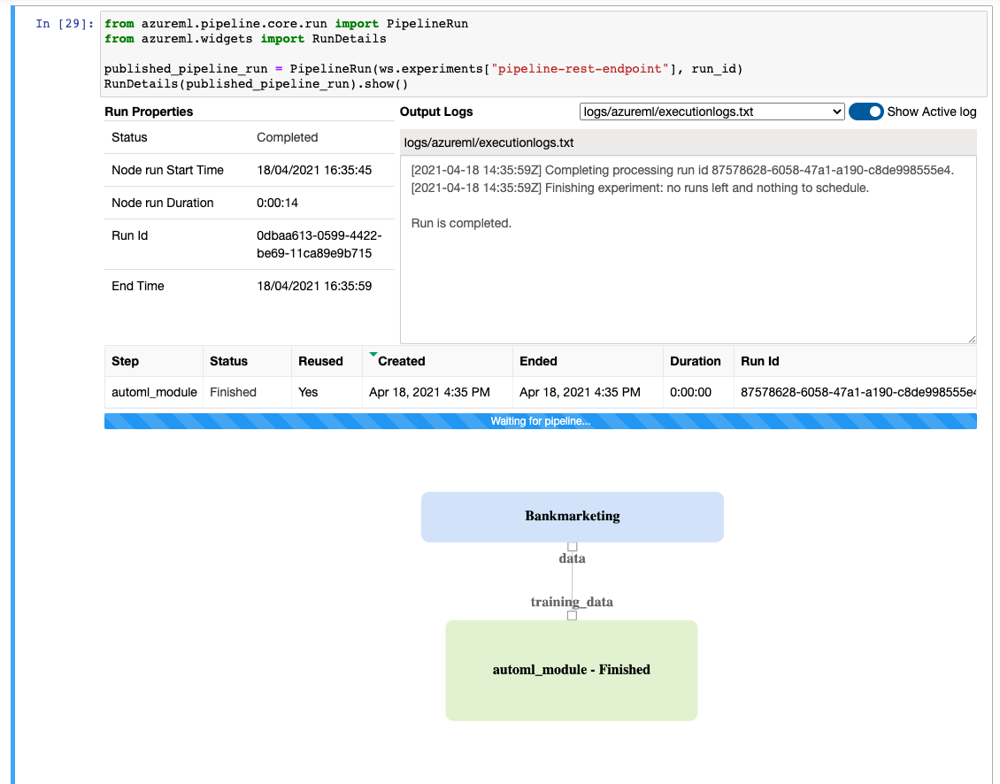

### Step 8: Documentation

A quick demo of the entire process of the working ML application can be found [here](https://www.youtube.com/watch?v=FqfATHnBhoM)

## Standout Suggestions

There is a clear class imbalance as pointed out in the AutoML's Data Guardrails. As seen in the confusion matrix and despite the impressive AUC and accuracy score, a significant percentage of the positive classes were wrongly classified. 

Deep learning can also be used to better improve the model as well as to increase the AutoML duration in order to give it more time for training and testing many more models. Given that only 20 AutoML runs were performed, this can be further increased. 

Better feature engineering can also be utilized with the use of ordinal instead of one-hot encoding for certain features.
